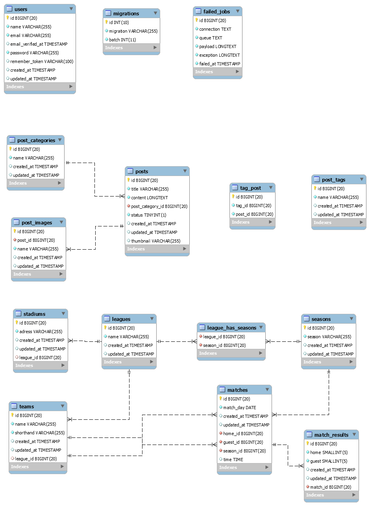

<h1 align="center"> Olsa Olsztyn</h1>

## About app
Olsa Olsztyn is a web application for volleyball league management with admin panel. 
The main functionalities are:
- leagues CRUD
- teams CRUD
- posts CRUD
- matches CRUD
- stadiums CRUD
- generates a schedule for league 
- calculates the last league season leaderboard for all leagues
- categories CRUD
- tags CRUD
- search posts by title

## Technologies
- PHP: 7.4.3 
- Laravel: 7.30.4
- Bootstrap: 4
- jQuery: 3.5.1

## Installation
- Clone this repository:
`git clone https://github.com/szymon9819/OlsaOlsztyn`
- Run composer install on the project directory: `composer install`
- Run npm install on the project directory: `npm install`
- Copy `.env.example` to `.env` and add your credentials for database
- Run migrations with user seeder(don't forget to add admin credentials on .env): `php artisan migrate --seed`
- Create the following folders on public directory: `images`, `images/postGaleryImages`, 
`images/postImages`, `images/postthumbnail`
- Run server with `php artisan serve` command or your preferred way
- Go to `/admin` route to login to admin panel

## DB Schema

